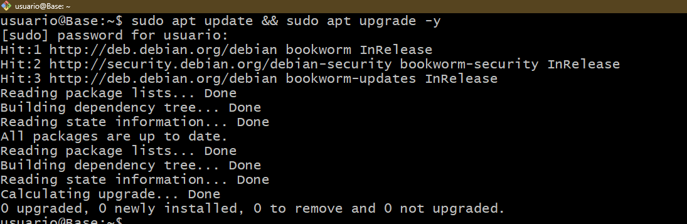
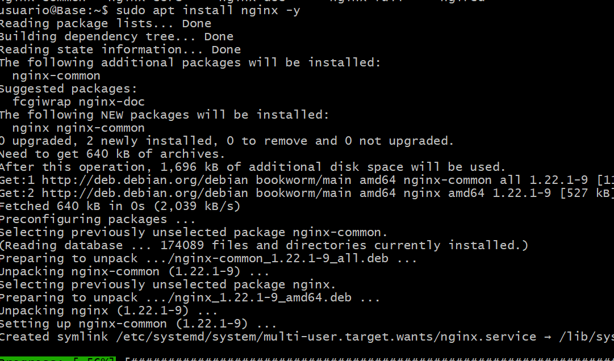
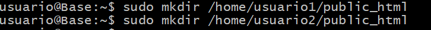
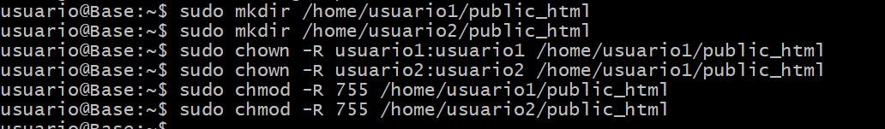
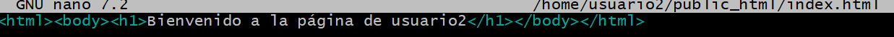
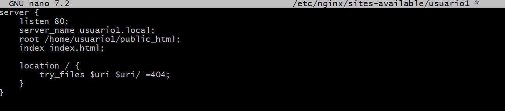
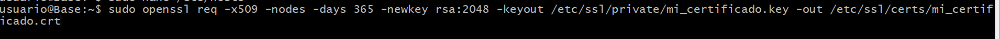
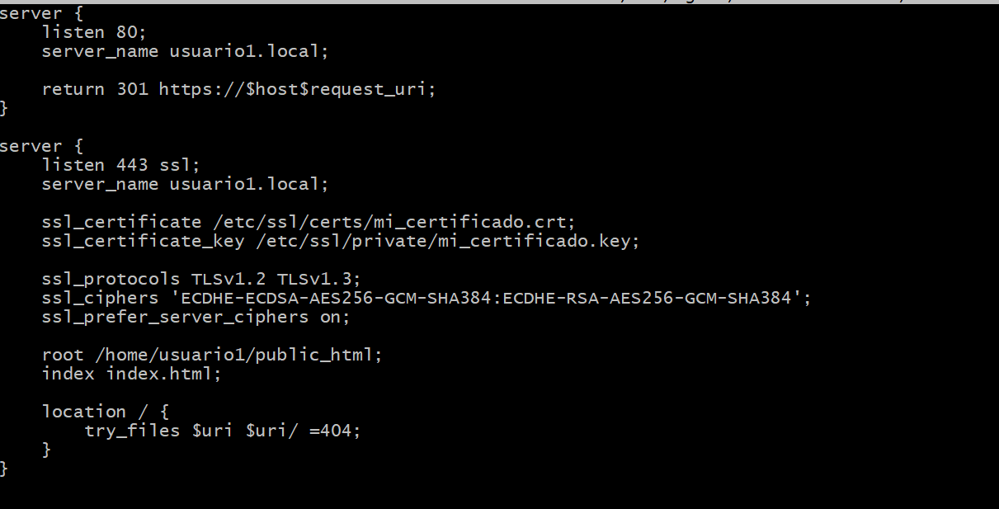
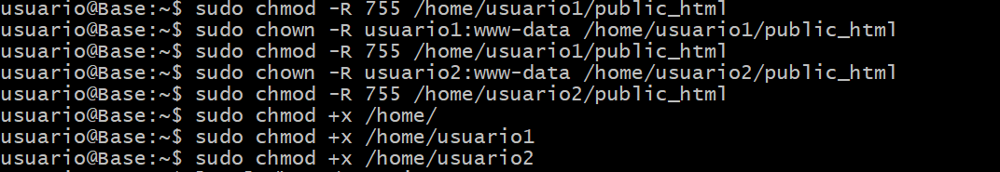

# Practica Ampliación. 
## Configuración de la práctica
El objetivo de esta práctica es configurar un servidor Nginx que utilice hosts virtuales para
alojar múltiples sitios web en un solo servidor y que cada host virtual apunte al directorio
public_html de distintos usuarios del sistema operativo Debian. De esta manera, cada usuario
podrá gestionar su propio sitio web desde su carpeta personal

## Documentación. 
### Instalación Nginx
Primero actualizaremos la lista de paquetes en los repositorios del sistema y luego instalaremos las versiones más recientes con el siguiente comando. 



Una vez actualizados instalaremos nginx con el siguiente comando.



Una vez instalado comprobaremos su estado para ver si está activo y funciona.


### Creación usuarios del sistema.
El siguiente paso será añadir los usuarios al sistema operativo. Con los comandos 

```console
sudo adduser <nombre_usuario>
```
Donde nos preguntarán el nombre completo, número de habitación, telefono propio, telefono fijo y confirmación de información. Para esté caso, como los usuarios no transcienden más que del ámbito de la práctica solo he puesto nombre. 


### Estructura de carpetas y archivos.
Una vez ya creados, crearemos la carpeta public_html propia de cada usuario con el comando **mkdir**.



Con el siguiente comando indicamos que la carpeta public_html, su propietario será el correspondiente usuario que la contenga asi como sus subdirectorios. Dandole completos permisos al propietario.



Crearemos respectivamente en cada carpeta public_html un breve index para informar de que la página a la que accedemos es del usuario1 o usuario2.




### Configuración básica de Nginx y creación de host virtuales.
A continuación crearemos el siguiente archivo en la carpeta sites-avaliable con el siguiente comando. 
```console
sudo nano /etc/nginx/sites-avaliable/usuario1
```
Eso lo haremos tanto con el usuario1 como el usuario2.

El siguiente archivo de configuración indicamos que se escuchará con el puerto 80 y le asignamos el nombre usuario1.local. La raíz del servidor está configurada en el directorio /home/usuario1/public_html, donde se encuentran los archivos del sitio. 
En el location se especifica el manejo de las solicitudes. 



Una vez creados los sitios de configuración tanto del usuario1 como del usuario2 crearemos el enlace simbólico correspondiente a sites-enabled.


### HTTPS
Ahora nos encargaremos de implementar la conexión segura mediante HTTPS. Con el siguiente comando genera un certificado SSL autofirmado  para poder hacer posible esta conexión. 



Para terminar de implementarla tendremos que ajustar la configuración de los archivos de nginx. 



Terminamos de darle permisos a las carpetas para que el usuario www-data que es el que se encarga de ejecutar procesos web y a las carpetas para que pueda acceder. 



Como resultado tenemos el siguiente. 


